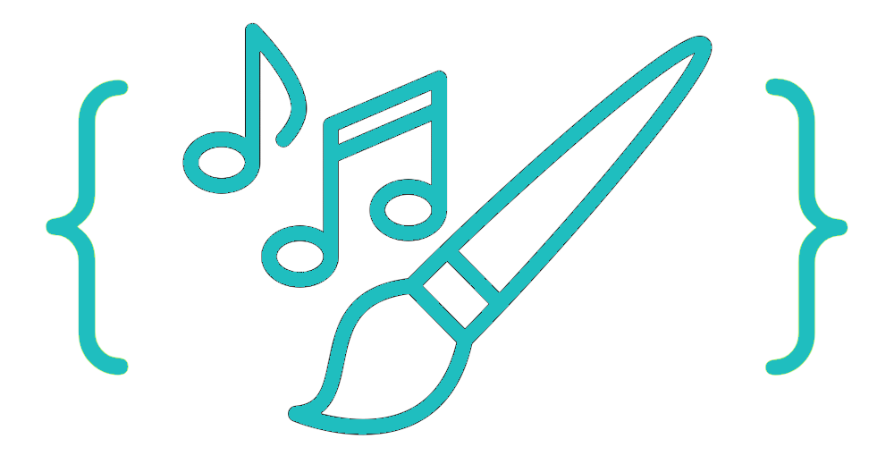

# CUNY TECH PREP 2023 Hackathon: The Arts & Tech 

## Team: WhoASCIIdCTP

    

HarmoniArt is a project that displays our attempt to generate art based on the gaussian algorithm using shapes. This project is made using JavaScript, HTML and CSS. To locally run this project, you need to install live server extension in Visual Studio code. Alternatively, you can visit our github pages link: https://hossainshakir.github.io/WhoASCIIdCTP/

### Features:

Implemented:
- [x] Generate art based on an algorithim
- [x] Select specific shapes to use on the art

To be implemented:
- Generate music based on an algorithm

### Screenshots:

### Contributing members:
Shakir Hossain,
Johnson Chen,
Daphne Tang,
Riaz Ahmed
